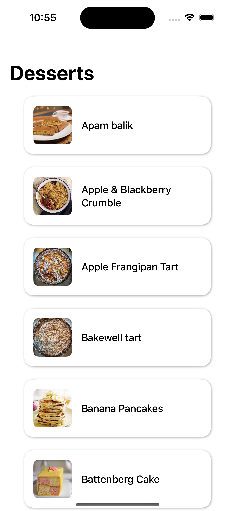
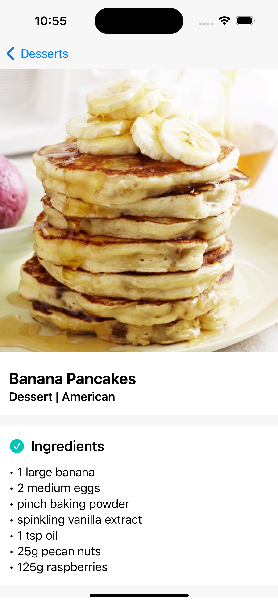

# Fetch iOS Coding Challenge

The app is built in Swift and SwiftUI with an MVVM architecture.

Upon opening the app, a list of desserts is fetched from TheMealDB API. Tapping on a dessert presents a detail view with the name, category, area, ingredients with measurements, and instructions.

 
